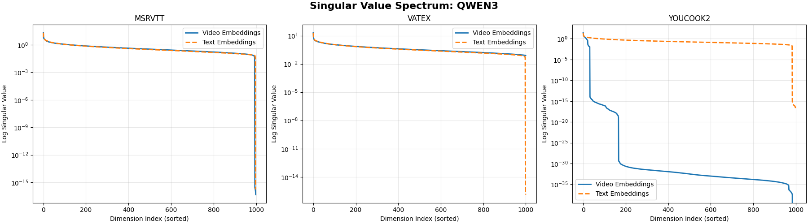
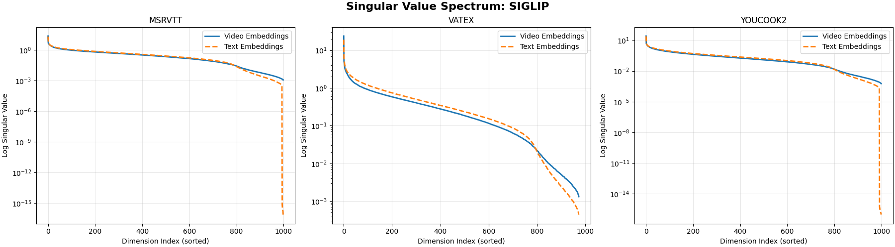
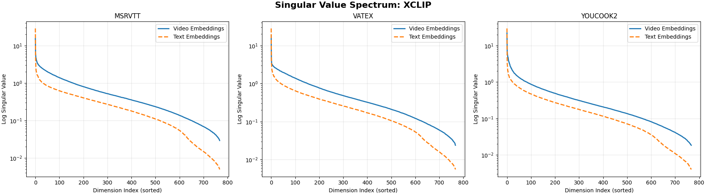
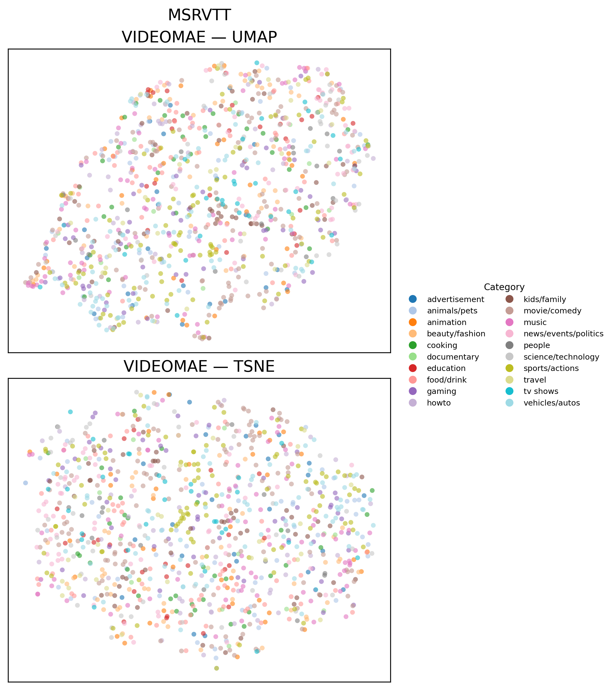
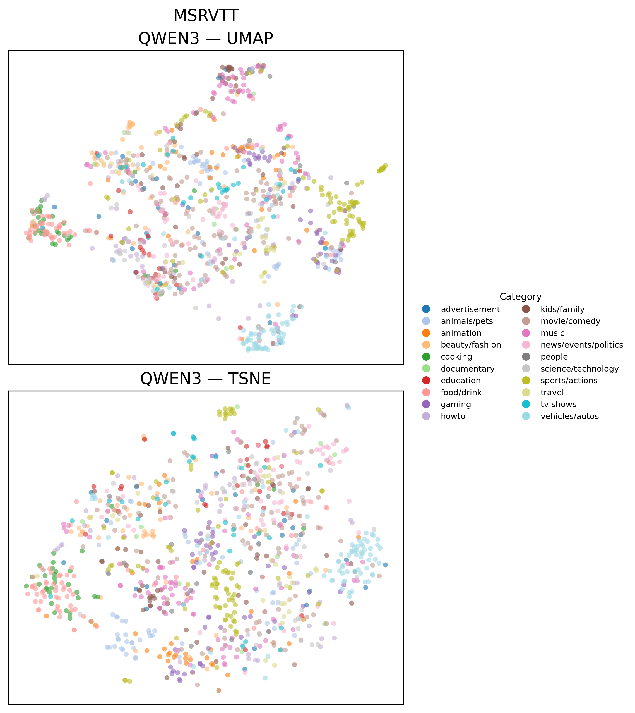
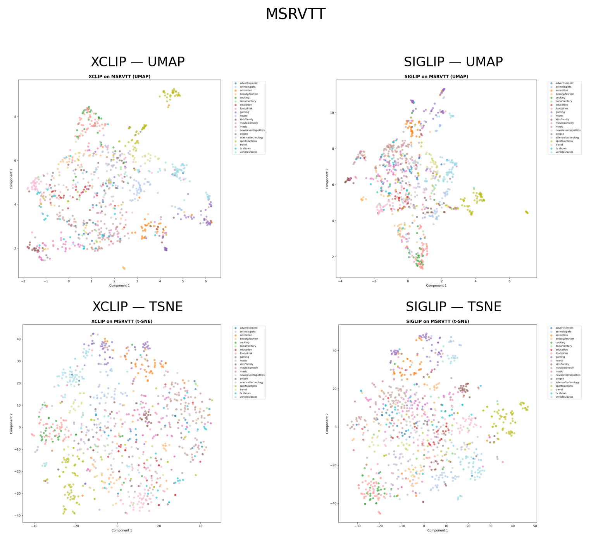

# Embedding Space Analysis

## Spectral Decomposition

- **Qwen3**: Экстремально низкие значения для видео после первых измерений на MSRVTT и VATEX, указывая на вырожденность пространства. На YouCook2 текстовые эмбеддинги имеют плоский спектр.

### Singular Value Spectrum: QWEN3

| Metric | MSRVTT | VATEX | YOUCOOK2 |
| :--- | :--- | :--- | :--- |
| **Video embeddings** | (999, 2560) | (1000, 2560) | (1000, 2560) |
| **Text embeddings** | (999, 2560) | (1000, 2560) | (1000, 2560) |
| **Matrix rank (video)** | 994/2560 | 1000/2560 | 32/2560 |
| **Matrix rank (text)** | 997/2560 | 998/2560 | 984/2560 |
| **Effective Rank (Video)** | 606.51 / 2560 | 602.89 / 2560 | 10.93 / 2560 |
| **Effective Rank (Text)** | 582.40 / 2560 | 572.76 / 2560 | 436.62 / 2560 |
| **Stable Rank (Video)** | 2.45 | 2.36 | 1.22 |
| **Modality Gap (L2)** | 0.1750 | 0.1292 | 0.8291 |

- **SigLIP**: Сбалансированное убывание для обеих модальностей, высокая информационная емкость на всех датасетах.

| Metric                 | MSRVTT        | VATEX         | YOUCOOK2      |
| ---------------------- | ------------- | ------------- | ------------- |
| Video embeddings       | (999, 1152)   | (974, 1152)   | (1000, 1152)  |
| Text embeddings        | (999, 1152)   | (974, 1152)   | (1000, 1152)  |
| Matrix rank (video)    | 951/1152      | 934/1152      | 891/1152      |
| Matrix rank (text)     | 900/1152      | 897/1152      | 863/1152      |
| Effective Rank (Video) | 453.81 / 1152 | 422.12 / 1152 | 349.55 / 1152 |
| Effective Rank (Text)  | 472.25 / 1152 | 457.55 / 1152 | 386.37 / 1152 |
| Stable Rank (Video)    | 1.80          | 1.72          | 1.46          |
| Modality Gap (L2)      | 0.9948        | 0.9945        | 1.0778        |

- **XCLIP**: Постепенное убывание сингулярных значений для видео, более резкое для текста. Эффективное использование ~200-400 измерений.

| Metric                 | MSRVTT       | VATEX        | YOUCOOK2     |
| ---------------------- | ------------ | ------------ | ------------ |
| Video embeddings       | (999, 768)   | (974, 768)   | (1000, 768)  |
| Text embeddings        | (999, 768)   | (974, 768)   | (1000, 768)  |
| Matrix rank (video)    | 768/768      | 768/768      | 768/768      |
| Matrix rank (text)     | 768/768      | 768/768      | 768/768      |
| Effective Rank (Video) | 438.73 / 768 | 431.03 / 768 | 343.58 / 768 |
| Effective Rank (Text)  | 325.54 / 768 | 323.29 / 768 | 258.25 / 768 |
| Stable Rank (Video)    | 4.15         | 2.84         | 2.01         |
| Modality Gap (L2)      | 0.9619       | 0.9831       | 1.0638       |

## Retrieval metrics

| Models        | XCLIP             | SIGLIP           | Qwen3-VL-2B      |
|---------------|-------------------|------------------|------------------|
| Recall @1/5/10 | 0.09 / 0.20 / 0.27 | 0.4 / 0.62 / 0.71 | 0.2 / 0.38 / 0.47 |
| NDCG@1/5/10   | 0.09 / 0.17 / 0.19 | 0.4 / 0.57 / 0.6  | 0.2 / 0.33 / 0.36 |
| MAP           | 0.14              | 0.49             | 0.28             |
| MedR          | 11                | 2                | 11               |

| Models        | XCLIP             | SIGLIP           | Qwen3-VL-2B      |
|---------------|-------------------|------------------|------------------|
| Vatex R @1/5/10 | 0.15 / 0.34 / 0.39 | 0.66 / 0.88 / 0.93 | 0.37 / 0.68 / 0.76 |
| Vatex MedR    | 11                | 1                | 2                |
| YouCook2 R @1/5/10  | 0.06 / 0.16 / 0.22 | 0.33 / 0.62 / 0.72 | 0.0 / 0.0 / 0.01  |
| YouCook2 MedR       | 11                | 3                | 11               |

### Результаты

**SigLIP демонстрирует наилучшую производительность** на всех трех датасетах, значительно превосходя альтернативные модели, несмотря на то, что это самая маленькая из представленных моделей (400м vs 2b + 4b Qwen3 vs 600м XCLIP). На MSRVTT модель достигает R@1=0.40 (в 4.4 раза лучше XCLIP), на VATEX — впечатляющие R@1=0.66 и R@10=0.93, что является очень сильным результатом для такого однообразного датасета.

**XCLIP показывает слабые результаты**, несмотря на мультигранулярную архитектуру. R@1 варьируется от 0.06 (YouCook2) до 0.15 (VATEX), что говорит о недостаточном выравнивании видео-текстовых представлений. Спектральный анализ показывает относительно здоровое распределение информации, но это не транслируется в хорошее retrieval качество.

**Qwen3-VL-2B демонстрирует смешанные результаты**. На VATEX модель показывает приемлемую производительность (R@1=0.37), но полностью проваливается на YouCook2 (R@1=0.00). Это может быть связано с доменной специфичностью: YouCook2 содержит кулинарные видео с более сложными инструкциональными текстами, которые требуют понимания последовательности действий. Спектральный анализ выявляет сильное вырождение видео эмбеддингов на MSRVTT и VATEX после первых компонент, что указывает на неэффективное использование размерности.

## Projections

### Геометрия пространств (UMAP/t-SNE)

- **SigLIP**: Четкие кластеры по категориям (sports, music, cooking, etc.) с относительно чистыми границами на UMAP. T-SNE показывает более смешанную структуру, но общая тенденция сохраняется.

- **XCLIP**: Умеренная кластеризация, некоторые категории (например, sports/actions, vehicles) формируют локальные группы, но значительное перекрытие.

- **Qwen3**: UMAP показывает смешанное распределение с неявной структурой. T-SNE выявляет некоторые локальные кластеры, но без четкой категориальной организации.

- **VideoMAE**: Наиболее плотное и недифференцированное пространство. Категории полностью перемешаны, что ожидаемо, так как у модели нет связи между семантикой картинки и ее пиксельным представлением.

## Results

### Специфика датасетов

**MSRVTT** (общий домен) — наиболее сбалансированный датасет с разнообразными категориями. SigLIP превосходит альтернативы с большим отрывом. Qwen3-VL показывает промежуточные результаты, но спектр выявляет проблемы в организации эмбеддингов.

**VATEX** (описательные подписи) — все модели показывают улучшенную производительность по сравнению с MSRVTT. SigLIP достигает почти идеального retrieval (R@10=0.93), Qwen3-VL также улучшается. Это говорит о том, что более длинные и описательные caption'ы облегчают выравнивание.

**YouCook2** (инструкциональные видео) — наиболее сложный датасет. Qwen3-VL полностью не справляется, вероятно из-за недостаточного pre-training на процедурных и инструкциональных данных. SigLIP сохраняет приемлемую производительность (R@1=0.33), демонстрируя робастность к доменному сдвигу.

### Практические рекомендации

1. **SigLIP — оптимальный выбор** для production video retrieval систем на основе доступных результатов. Модель обеспечивает лучший баланс качества и стабильности на разных доменах.

2. **Qwen3-VL** требует domain-specific fine-tuning, особенно для инструкциональных видео. Модель имеет потенциал благодаря архитектурным улучшениям (Interleaved-MRoPE, DeepStack), но базовые эмбеддинги нуждаются в адаптации.

3. **XCLIP** уступает современным альтернативам, несмотря на теоретические преимущества мультигранулярного обучения. Возможно, требуется fine-tuning или использование более свежих checkpoint'ов.

4. **VideoMAE** не подходит для video-text retrieval без дополнительного text encoder'а и совместного обучения, так как изначально обучался только на видео данных.

5. **Спектральный анализ** должен быть частью стандартного pipeline'а оценки эмбеддингов — он выявляет вырождение пространств до проведения дорогостоящих экспериментов.

### Направления дальнейших исследований

- **Temporal modeling**: Исследование влияния временной агрегации кадров (mean pooling vs attention vs temporal transformers), в нашей системе мы генерировали эмбединги для видео через простое усреднение эмбеддингов кадров.
- **Multimodal fusion**: Комбинирование эмбеддингов различных моделей (ensemble подход)
- **Dimension reduction**: Изучение возможности снижения размерности без потери качества на основе спектрального анализа

Этот проект наглядно демонстрирует важность комплексного анализа эмбеддингов, включающего как количественные метрики (Recall, NDCG, MAP), так и качественный анализ пространств признаков (спектральная декомпозиция, визуализация). Результаты подчеркивают, что архитектурная сложность не гарантирует лучшее качество — простота и эффективность SigLIP превосходят более сложные альтернативы.
